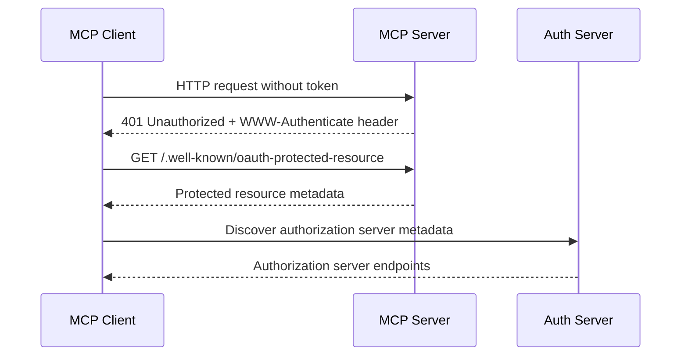
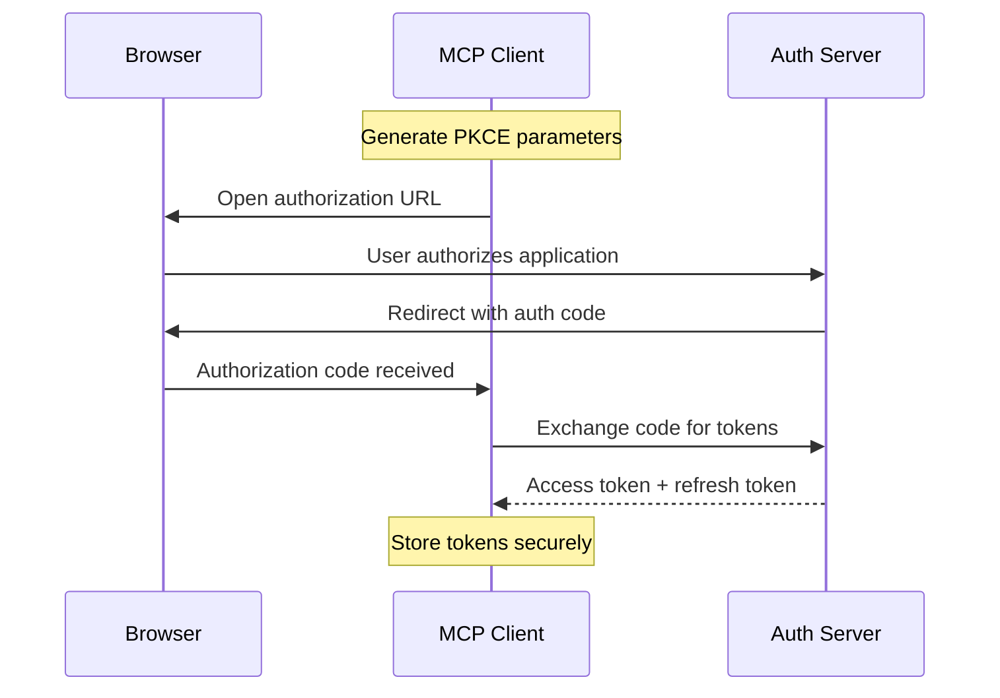

# OAuth Integration for MCP

This document describes how to configure and use OAuth authentication with MCP servers in the Enconvo platform.

## Overview

The MCP OAuth integration implements the [Model Context Protocol Authorization specification](https://modelcontextprotocol.io/specification/draft/basic/authorization) with full support for:

- **OAuth 2.1 Authorization Code Flow with PKCE**
- **Dynamic Client Registration (RFC7591)**
- **Authorization Server Discovery (RFC8414 & OpenID Connect Discovery)**
- **Protected Resource Metadata (RFC9728)**
- **Resource Indicators (RFC8707)**
- **Automatic token management and refresh**

## Configuration

### Manifest Configuration

Add OAuth configuration to your `manifest.json`:

```json
{
  "server": {
    "type": "http",
    "entry_point": "https://your-mcp-server.com/mcp",
    "oauth_config": {
      "enabled": true,
      "client_id": "${user_config.oauth_client_id}",
      "client_secret": "${user_config.oauth_client_secret}",
      "redirect_uri": "http://localhost:8080/callback",
      "scope": "read write",
      "auto_register": true
    }
  },
  "user_config": {
    "oauth_client_id": {
      "type": "string",
      "title": "OAuth Client ID",
      "description": "OAuth client ID (leave empty for auto-registration)",
      "required": false
    },
    "oauth_client_secret": {
      "type": "string",
      "title": "OAuth Client Secret",
      "description": "OAuth client secret (for confidential clients)",
      "required": false,
      "secret": true
    }
  }
}
```

### Configuration Options

| Option | Type | Description | Default |
|--------|------|-------------|---------|
| `enabled` | boolean | Enable/disable OAuth authentication | `false` |
| `client_id` | string | OAuth client ID (optional if auto_register is true) | - |
| `client_secret` | string | OAuth client secret (for confidential clients) | - |
| `redirect_uri` | string | OAuth redirect URI | `http://localhost:8080/callback` |
| `scope` | string | OAuth scopes to request | - |
| `auto_register` | boolean | Enable dynamic client registration | `true` |

## How It Works

### 1. Initial Request Flow



### 2. Authorization Flow



### 3. Authenticated Requests

All subsequent HTTP/SSE requests to the MCP server include the `Authorization: Bearer <token>` header automatically.

## Token Management

### Automatic Token Storage

Tokens are automatically stored in `~/.mcp/tokens.json` with the following structure:

```json
{
  "https://mcp.example.com:client-id:https://auth.example.com": {
    "access_token": "...",
    "token_type": "Bearer",
    "expires_at": 1640995200000,
    "refresh_token": "...",
    "scope": "read write",
    "resource": "https://mcp.example.com",
    "client_id": "client-id",
    "authorization_server": "https://auth.example.com"
  }
}
```

### Token Refresh

Tokens are automatically refreshed when:
- The access token is expired
- A refresh token is available
- The authorization server supports token refresh

### Token Security

- Tokens are stored locally on the user's machine
- No tokens are transmitted to Enconvo servers
- Expired tokens are automatically cleaned up
- All OAuth flows use PKCE for additional security

## Server Requirements

For MCP servers to support OAuth authentication, they must:

### 1. Implement Protected Resource Metadata (RFC9728)

Serve metadata at `/.well-known/oauth-protected-resource`:

```json
{
  "resource": "https://your-mcp-server.com",
  "authorization_servers": [
    "https://your-auth-server.com"
  ]
}
```

### 2. Return 401 with WWW-Authenticate Header

When no valid token is provided:

```http
HTTP/1.1 401 Unauthorized
WWW-Authenticate: Bearer realm="https://your-mcp-server.com", 
                  resource_metadata="https://your-mcp-server.com/.well-known/oauth-protected-resource"
```

### 3. Validate Access Tokens

- Verify tokens were issued specifically for your server
- Check token expiration
- Validate scopes if applicable
- Return appropriate errors for invalid tokens

## Authorization Server Requirements

Authorization servers must support:

### 1. OAuth 2.1 with PKCE

- Authorization Code flow
- PKCE with S256 method (required)
- Resource indicators (RFC8707)

### 2. Discovery Metadata

Serve metadata at one of these endpoints:
- `/.well-known/oauth-authorization-server` (OAuth 2.0)
- `/.well-known/openid-configuration` (OpenID Connect)

Required fields:
```json
{
  "issuer": "https://your-auth-server.com",
  "authorization_endpoint": "https://your-auth-server.com/authorize",
  "token_endpoint": "https://your-auth-server.com/token",
  "code_challenge_methods_supported": ["S256"],
  "response_types_supported": ["code"],
  "grant_types_supported": ["authorization_code", "refresh_token"]
}
```

### 3. Dynamic Client Registration (Recommended)

Implement RFC7591 for automatic client registration:

```json
{
  "registration_endpoint": "https://your-auth-server.com/register"
}
```

## Examples

### Basic HTTP Server with OAuth

```json
{
  "server": {
    "type": "http",
    "entry_point": "https://api.example.com/mcp",
    "oauth_config": {
      "enabled": true,
      "auto_register": true,
      "scope": "mcp:read mcp:write"
    }
  }
}
```

### SSE Server with Pre-registered Client

```json
{
  "server": {
    "type": "sse",
    "entry_point": "https://events.example.com/mcp",
    "oauth_config": {
      "enabled": true,
      "client_id": "pre-registered-client-id",
      "auto_register": false,
      "scope": "mcp:events"
    }
  }
}
```

### Confidential Client

```json
{
  "server": {
    "type": "http",
    "entry_point": "https://secure.example.com/mcp",
    "oauth_config": {
      "enabled": true,
      "client_id": "${user_config.client_id}",
      "client_secret": "${user_config.client_secret}",
      "auto_register": false
    }
  }
}
```

## Troubleshooting

### Common Issues

1. **"PKCE not supported"**
   - Ensure the authorization server supports PKCE with S256
   - Check the `code_challenge_methods_supported` field in server metadata

2. **"Token audience validation failed"**
   - Verify the MCP server validates token audience correctly
   - Ensure the resource parameter matches the server's canonical URI

3. **"Authorization timeout"**
   - Check if the browser can access the authorization URL
   - Verify the redirect URI is accessible
   - Ensure no firewall is blocking the callback server

4. **"Dynamic registration failed"**
   - Set `auto_register: false` and provide a client_id manually
   - Check authorization server logs for registration errors

### Debug Mode

Enable debug logging by setting environment variable:

```bash
DEBUG=oauth* npm run dev
```

### Token Inspection

Use the token manager to inspect stored tokens:

```typescript
import { TokenManager } from "./token-manager.js";

const tokenManager = new TokenManager();
await tokenManager.loadTokens();
const tokens = await tokenManager.getAllTokens();
console.log(tokens);
```

## Security Considerations

1. **Always use HTTPS** for authorization servers and MCP servers
2. **Validate token audience** on the server side
3. **Don't pass tokens through** to upstream services
4. **Use short-lived access tokens** when possible
5. **Rotate refresh tokens** for public clients
6. **Store tokens securely** and clean up expired tokens

## Standards Compliance

This implementation follows these specifications:

- [OAuth 2.1 (draft-ietf-oauth-v2-1-13)](https://datatracker.ietf.org/doc/html/draft-ietf-oauth-v2-1-13)
- [OAuth 2.0 Authorization Server Metadata (RFC8414)](https://datatracker.ietf.org/doc/html/rfc8414)
- [OAuth 2.0 Dynamic Client Registration (RFC7591)](https://datatracker.ietf.org/doc/html/rfc7591)
- [OAuth 2.0 Protected Resource Metadata (RFC9728)](https://datatracker.ietf.org/doc/html/rfc9728)
- [Resource Indicators for OAuth 2.0 (RFC8707)](https://datatracker.ietf.org/doc/html/rfc8707)
- [OpenID Connect Discovery 1.0](https://openid.net/specs/openid-connect-discovery-1_0.html)

For the complete MCP Authorization specification, see: https://modelcontextprotocol.io/specification/draft/basic/authorization